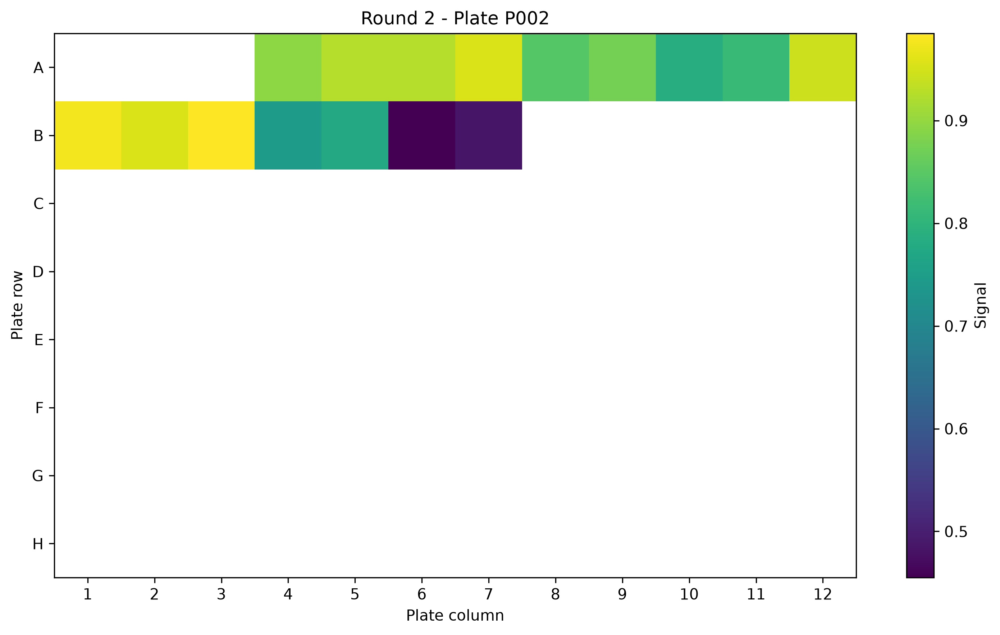
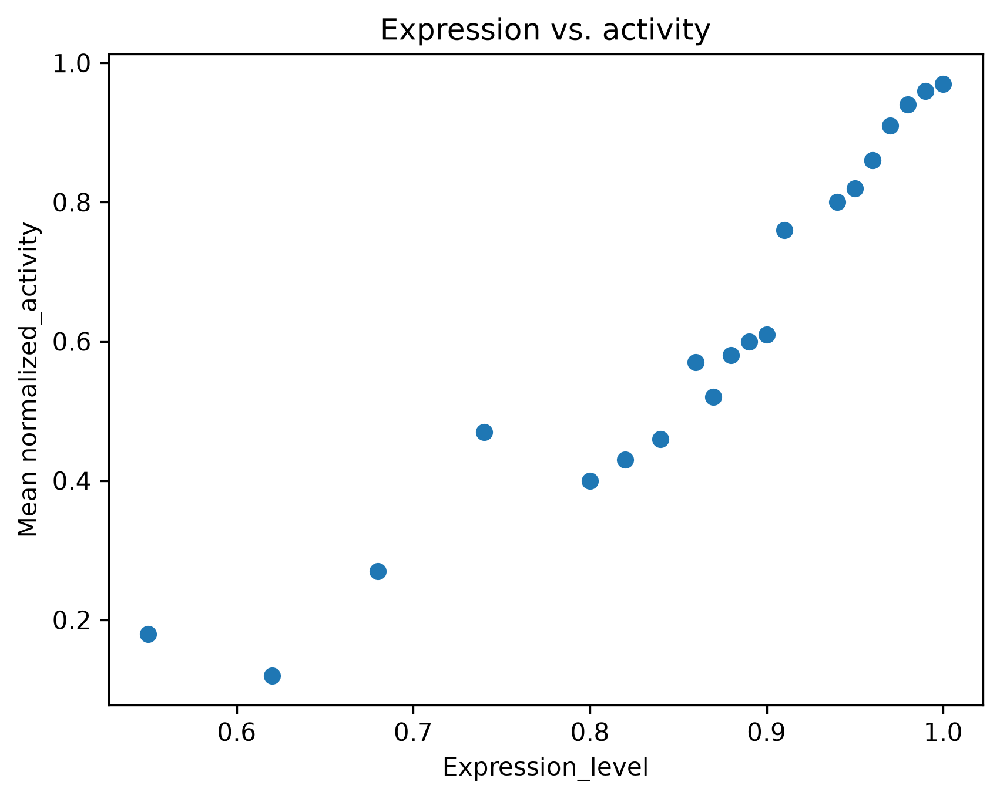
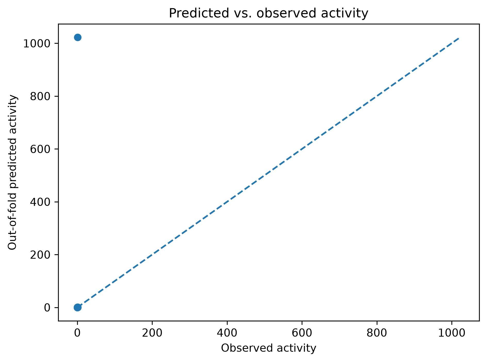

# Molecular Screening Analysis Report

## Overview

This analysis integrates plate-assay quality control, signal normalization, protein sequence features, expression measurements, group-aware machine learning, and prospective candidate ranking.

Measured variants: 21

Screening rounds: 3

Hit threshold: 0.500

## Quality Control

Plates analyzed: 3

Sample measurements: 42

Missing expected wells: 0

Positive-control normalization valid: True

## Directed-Evolution Progress

|Round|Variants|Mean activity|Best activity|Hits|
|---|---|---|---|---|
|0|1|0.400|0.400|0|
|1|12|0.502|0.860|7|
|2|8|0.834|0.970|7|

## Model Validation

Regression metrics were calculated using group-aware cross-validation, with screening round used as the grouping variable.

- MAE: 42.705
- RMSE: 120.487
- R²: -2731517.260
- Valid R² folds: 2/3

Classification metrics:

- Accuracy: 0.514
- Precision: 0.530
- Recall: 0.571

## Candidate Ranking

No candidate ranking was generated

## Figures

### Plate activity

### Expression and activity

### Model prediction

## Limitations

1. The measured dataset is small and contains only a few directed-evolution rounds.

2. Round 0 contains only the parent variant. Therefore R² is undefined when that round forms a one-sample validation fold; MAE and RMSE remain computable.

3. The prospective R3 candidates contain four substitutions, whereas the measured training set contains at most three substitutions. Candidate ranking therefore extrapolates along the mutation-count feature.

4. The current sequence representation relies mainly on amino-acid composition and bulk physicochemical properties. It does not explicitly encode mutation position or residue order, so distinct positional mutations may receive very similar representations.

5. Expression is used as a model predictor. Prospective ranking therefore assumes that candidate expression is available from a preliminary measurement or prediction before the functional assay.

## Reproducibility

Machine-readable model metrics are available in `model_scores.json`.

Candidate scores are available in `ranked_candidates.csv`.

Out-of-fold regression predictions are stored in `intermediate/regression_oof_predictions.csv`.
